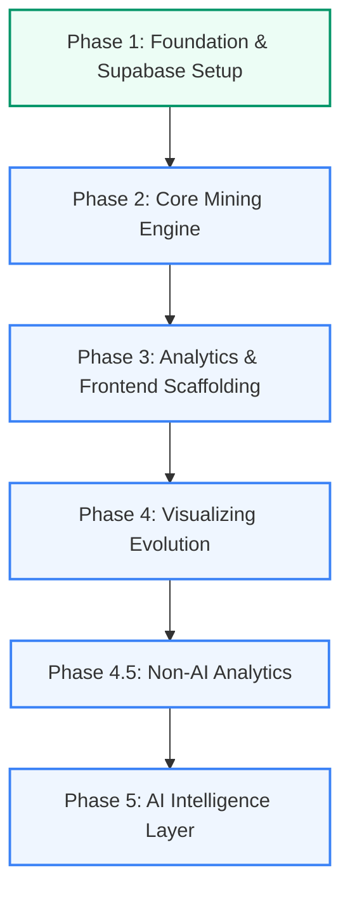

# GitCompass — Development Roadmap

This document outlines the planned phases and salient features for the development of GitCompass. It serves as a guide for building out the platform from a foundational database layer to an AI-augmented architectural intelligence platform.

---

## 🧭 Development Roadmap Overview



---

## 📦 Phase 2: The Core Mining Engine (FastAPI & Git Layer)
**Goal:** Build the backend capability to clone repositories, parse raw Git histories in bulk, and ingest data efficiently without blocking the server or leaking disk space.

### Salient Features & Architecture
1. **The `Cloner` Module:**
   - Securely clones any public GitHub repository (and eventually private ones via OAuth tokens) to a temporary directory.
   - Utilizes Python's `tempfile` module or a dedicated `tmp_repos/` scratch folder.
   - Enforces a strict **cleanup protocol** via `shutil.rmtree` in a teardown stage or inside Python's context managers to prevent disk storage leaks.
2. **The `Traverser` & `Extractor` Modules:**
   - **Bulk Extraction Optimization:** Avoids the N+1 process trap (running `git show` in a loop). Parses git logs using a single high-performance stream command:
     ```bash
     git log --numstat --format="COMMIT:%H|%an|%ae|%at|%s" -M
     ```
   - **File Rename Tracking:** Normalizes file paths across renames using the `-M` flag so that history before and after a rename (e.g. `utils/auth.js` -> `src/auth.js`) aggregates correctly under the current file path.
3. **Asynchronous Background Processing:**
   - Git mining operations run out-of-band using FastAPI's `BackgroundTasks` (or an asynchronous queue like Celery or RQ if tasks exceed a few seconds).
   - Ingestion endpoints return a tracking ID and `202 Accepted` immediately, allowing the UI to poll or subscribe to progress.
4. **Data Ingestion:**
   - Bypasses RLS utilizing the **service role key client** (`get_service_client()`) to bulk write repository commits and diff statistics to Supabase database.

---

## 📊 Phase 3: Analytics & Frontend Scaffolding
**Goal:** Compute analytical indexes from the raw history and build a minimalist, highly readable frontend interface highlighting problematic codebase zones.

### Salient Features & Architecture
1. **The Churn Analyzer (Backend):**
   - Aggregates file modification frequencies, total insertions, and deletions.
   - Ranks files based on **code churn** to locate volatile areas of the codebase.
2. **The Contributor Analyzer (Backend):**
   - Computes an **ownership score** per file (e.g., proportion of changes or commits authored by specific individuals).
   - Identifies "knowledge silos" (files with high complexity owned by a single author) and "high-friction areas" (files edited by too many developers simultaneously).
3. **Repository Dashboard (Frontend):**
   - Clean, light-themed dashboard showing repository aggregates (total commits, file count, active contributors, language breakdown).
   - Displays a list of owned/tracked repositories with import status indicators.
4. **Interactive Hotspot Table:**
   - A tabular view highlighting high-risk files.
   - Sortable by churn rate, size, and ownership concentration index.

---

## 🎨 Phase 4: Visualizing Evolution
**Goal:** Provide developers with an interactive visual map of their repository's architectural structure, using visual indicators to mark hotspots.

### Salient Features & Architecture
1. **Module Hierarchy Visualization:**
   - Interactive structure diagram (using **React Flow** or **D3.js**) mapping directory structures as nodes and parent-child edges.
   - Designed cleanly following the minimalist light-theme constraints (using abundant white space, soft grids, clean sans-serif typography).
2. **High-Risk Zone Heatmap:**
   - Visually scales or colors nodes based on calculated risk (e.g., sizing folders by total line volume, coloring nodes red/yellow based on high churn and low ownership distribution).
   - Nodes can be collapsed/expanded to analyze specific subdirectories without cluttering the screen.
3. **Interactive Search & Filtering:**
   - Filter views by file extension, contributor, or specific timeline brackets.

---

## 📈 Phase 4.5: Deep Architectural Analytics (Non-AI)
**Goal:** Extract deep, deterministic architectural signals from Git history for technical audits prior to AI integration.

### Salient Features & Architecture
1. **Conventional Commit Categorization:**
   - Differentiate "Feature/Fix" churn from "Docs/Style".
   - **Backend:** Parse commit messages via regex during extraction and store `commit_type` in Supabase.
   - **Frontend:** Interactive filters on the D3 Treemap to highlight specific churn (e.g., bug-prone zones).
2. **Temporal Coupling (Co-Change Matrix):**
   - Identify hidden dependencies (files frequently changing together).
   - **Backend:** Algorithm calculates coupling degrees ($>50\%$ threshold), filtering out noise (commits with $>50$ files).
   - **Frontend:** Hovering a file in the Treemap highlights temporally coupled sibling files.
3. **Bus Factor & Knowledge Loss Index:**
   - Measure knowledge concentration to flag personnel risks.
   - **Backend:** Calculate knowledge distribution per file and an overall repository Bus Factor.
   - **Frontend:** Display Orphan Risk Score badges in the UI for files where primary contributors haven't committed in 90 days.
4. **Time Machine (Historical Filtering):**
   - Analyze churn within custom timeframes instead of just lifetime.
   - **Backend:** API endpoints accept dynamic `start_date` and `end_date` query filters.
   - **Frontend:** Global date-range slider implemented on the analytics dashboard.
5. **Export Capabilities & Incremental Sync:**
   - Tangible deliverables and optimized repository updates.
   - **Frontend:** Export options for CSV (Hotspots/Coupling) and SVG/PNG (Treemap).
   - **Backend:** Delta extraction (`git log <sha>..HEAD`) using `latest_commit_sha` to bypass full re-parsing.

---

## 🤖 Phase 5: AI Intelligence Layer
**Goal:** Integrate semantic reasoning into the historical data to provide onboarding developers and tech leads with plain-english narratives of how the codebase evolved.

### Salient Features & Architecture
1. **AI Summarizer:**
   - Batches commits into chronological windows (e.g., sprints, months, releases).
   - Sends diffs and commit logs to the **Gemini API** using structured prompts.
   - Generates readable narratives answering: *What changed in this period, why was it changed, and what architectural tradeoffs were made?*
2. **Architecture Shift Detector:**
   - Employs the LLM to inspect commits for structural signals (e.g., migrations, architectural pattern shifts, dependency updates).
   - Annotates these key historical moments on a visual timeline in the UI.
3. **Onboarding Assistant / QA Chat:**
   - An interactive chat interface where users can ask questions about evolution, e.g., *"Why was the authentication mechanism rewritten in April?"* or *"Who is the best person to review changes to the database layer?"*
